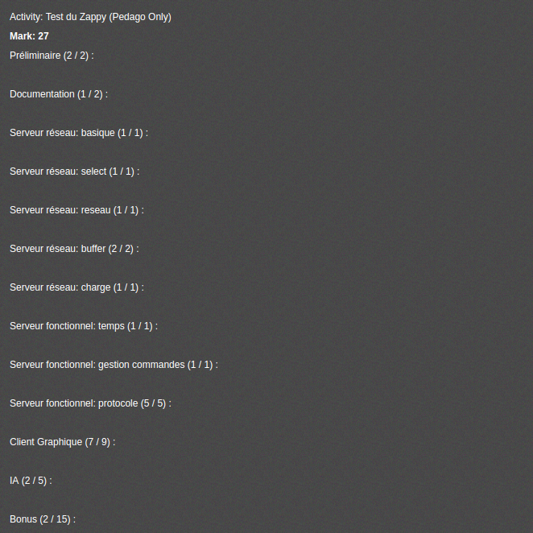
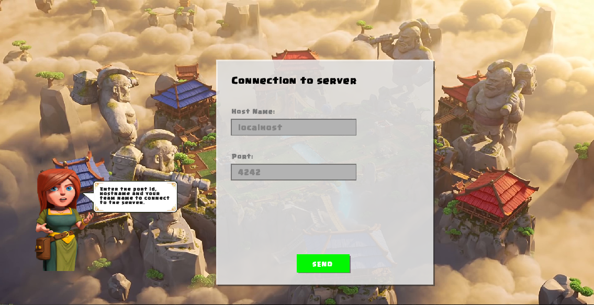
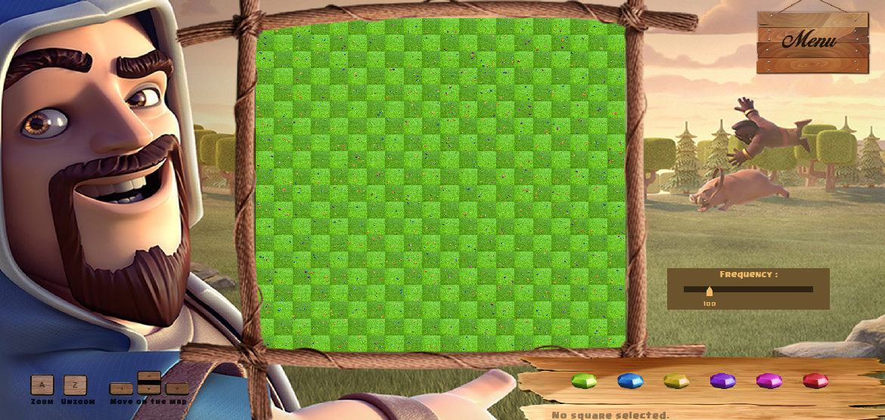

# Readme Zappy

### Contributors

[Tristan Flatot](https://github.com/Flatot)

[Nicolas Rubio](https://github.com/RubioN)

[Théo Ferreira](https://github.com/theo-hubgrade)

Florian Giroud

Valentin Gabriel

### Rating

## 0. Recommendation
It is recommended to run in this order: the server, the graphical client then the AI.

## 1. Server

Launching server:
> ./zappy_server -p port -x width -y height -n name1 name2 ... -c clientsNb -f freq

* port is the port number
* width is the width of the world
* height is the height of the world
* nameX is the name of the team X
* clientsNb is the number of authorized clients per team
* freq is the reciprocal of time unit for execution of actions

***

## 2. Graphical Client

Before launching graphical client:
> export LD_LIBRARY_PATH=$LD_LIBRARY_PATH:.

Launching graphical client:
> ./zappy_graphical

Graphical commands:
* A: Zoom
* Z: Unzoom
* Arrows: Move on the map
* Left click: Focus on tile
* Right click: Scroll to clicked tile
* Escape: Go back to previous step
* Alt + F4: Close graphical window

***

## 3. AI

Launching AI:
>  ./zappy_ai -p port -n name -h machine

* port is the port number
* name is the name of the team
* machine is the name of the machine; localhost by default

***
